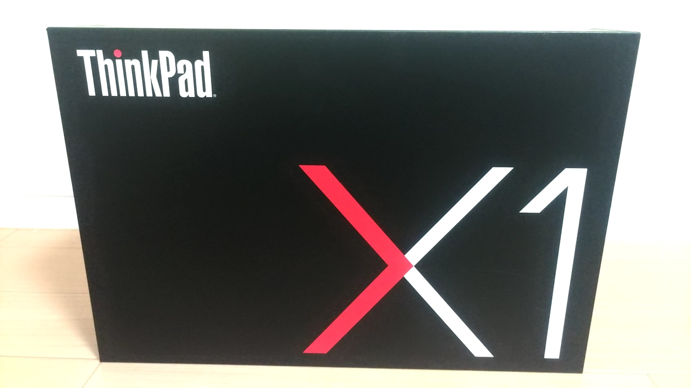
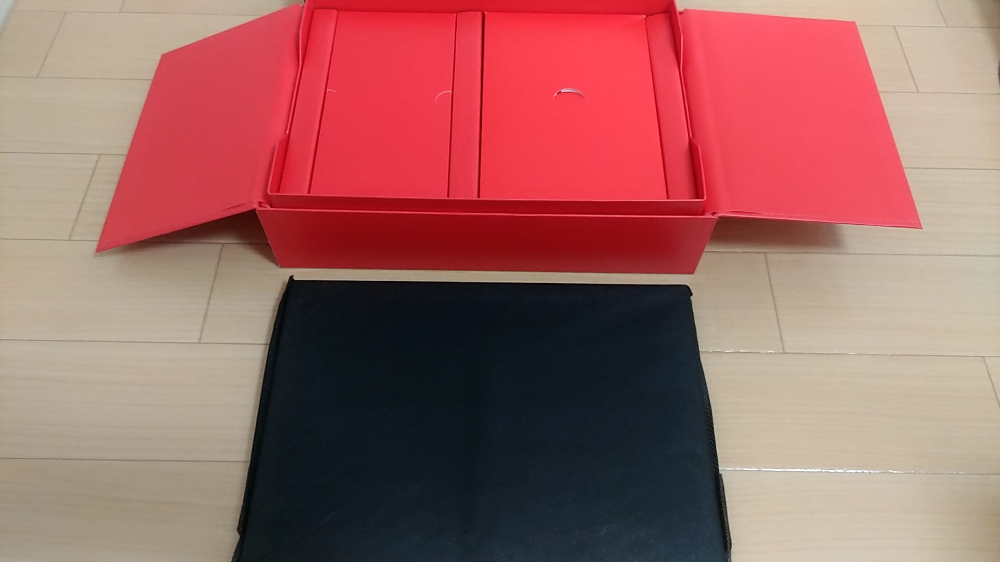
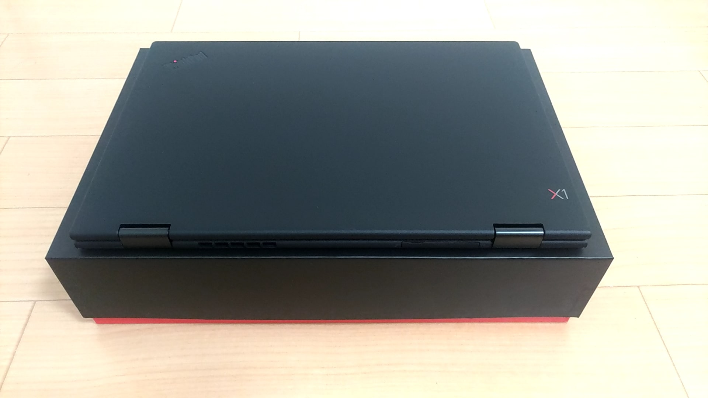

どうも、よしかわです。10月3日にThinkPad X1 Yogaが届いたので、レビューしたいと思います。

### 対象読者

- Macから乗り換えたい人
- PCを持っているがタブレットを持っていない人

### はじめに

僕がThinkPad X1 Yogaを購入した経緯について話します。

夏休みが明ける前に大学1年生のときに購入したMacBook Airのディスプレイが立ち上がらなくなりました。

その時は、多少無理してMacBook Proを購入しようかと思いました。

僕がMacOSを使うメリットがあまりなかったので。Linuxが動けばいいという結論に至りました。

持ち運びしやすいCarbonにするか、タブレットとしても使える便利なYogaにするかで悩みました。

### 決め手

僕はiPadなどのタブレットを持ち合わせていないため、タブレットとしても使えるYogaにしました。

また、ThinkPadはArchWikiが盛んであったため、決め手になりました。

### 仕様

重さはMacBook Proより少し重い1.41kg

ワコム製のペンはとても使いやすいです。

### カスタマイズ

仮想環境を使うので、メモリを16GBにしました。

SSDはNVMe M.2 SSDの512GBに変更しました。

キーボードはUS配列

WQHD 2560×1440

### 開封

箱がとても大きかったので、驚きました。

中から赤い箱が出てきたので、開けていく。

黒いヤツのお出ましさ。

### 今後の予定

X1 YogaにArch Linuxを導入したいと思います。