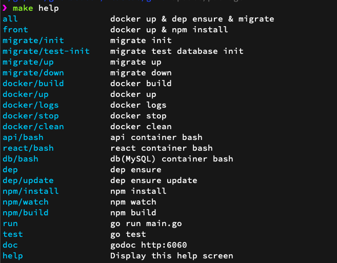

## Makefile で分かりやすく文書化する

現在, 研究に Go 言語を使っています.

ターミナルに `docker-compose up -d` を入力を繰り返すことが多々あるので, Makefile を使うことにしました.

### そもそも Make って

> make（メイク）は、プログラムのビルド作業を自動化するツール。コンパイル、リンク、インストール等のルールを記述したテキストファイル (makefile) に従って、これらの作業を自動的に行う。
>
> 引用: [make - Wikipedia](https://ja.wikipedia.org/wiki/Make)

.zshrc などに書く alias とは違い, 各ディレクトリに配置出来るので便利.

よく使うコマンドは Makefile に保存しちゃいましょう.

あとは GitHub にあげておけば, 使うコマンドが何かを共有出来ますし便利.

### Go 言語で使う場合

DRY 原則で書いてるんですけど, まだまだですね...

よく使うコマンドや変数は, ファイルの先頭で宣言をすると便利です.

クロスコンパイル用のコマンドを置いておくと便利ですね.

```makefile
GOCMD=go
GORUN=$(GOCMD) run
GOBUILD=$(GOCMD) build
GOCLEAN=$(GOCMD) clean
GOTEST=$(GOCMD) test
GOGET=$(GOCMD) get
GODOC=$(GOCMD)doc
COMPOSE=docker-compose
COMPOSEEXEC=$(COMPOSE) exec
COMPOSEBUILD=$(COMPOSE) build
COMPOSEUP=$(COMPOSE) up -d
COMPOSELOGS=$(COMPOSE) logs
COMPOSESTOP=$(COMPOSE) stop
COMPOSERM=$(COMPOSE) rm
DBNAME:=makefile
TESTDBNAME:=test_makefile

all: docker/up dep migrate/init migrate/up ## docker up & dep ensure & migrate

front: docker/up npm/install ## docker up & npm install

migrate/init: ## migrate init
	mysql -u root -h localhost --protocol tcp -e "create database \`$(DBNAME)\`" -p

migrate/test-init: ## migrate test database init
	mysql -u root -h localhost --protocol tcp -e "create database \`$(TESTDBNAME)\`" -p

migrate/up: ## migrate up
	$(COMPOSEEXEC) api goose up

migrate/down: ## migrate down
	$(COMPOSEEXEC) api goose down

docker/build: ## docker build
	$(COMPOSEBUILD)

docker/up: ## docker up
	$(COMPOSEUP)

docker/logs: ## docker logs
	$(COMPOSELOGS)

docker/stop: ## docker stop
	$(COMPOSESTOP)

docker/clean: ## docker clean
	$(COMPOSERM)

api/bash: ## api container bash
	$(COMPOSEEXEC) api bash

react/bash: ## react container bash
	$(COMPOSEEXEC) react bash

db/bash: ## db(MySQL) container bash
	$(COMPOSEEXEC) db bash

dep: ## dep ensure
	$(COMPOSEEXEC) api dep ensure

dep/update: ## dep ensure update
	$(COMPOSEEXEC) api dep ensure -update

npm/install: ## npm install
	$(COMPOSEEXEC) react npm install

npm/watch: ## npm watch
	$(COMPOSEEXEC) react npm run watch

npm/build: ## npm build
	$(COMPOSEEXEC) react npm run build

run: ## go run main.go
	$(COMPOSEEXEC) api $(GORUN) main.go

test: ## go test
	$(COMPOSEEXEC) api $(GOTEST) -v ./...

doc: ## godoc http:6060
	$(GODOC) -http=:6060

help: ## Display this help screen
	@grep -E '^[a-zA-Z/_-]+:.*?## .*$$' $(MAKEFILE_LIST) | awk 'BEGIN {FS = ":.*?## "}; {printf "\033[36m%-20s\033[0m %s\n", $$1, $$2}'
```

下の画像は, 実際に `make help` を実行したときのターミナルです.



### 参考文献

[Golang を使うなら Makefile を恐れるな](https://frasco.io/golang-dont-afraid-of-makefiles-785f3ec7eb32)

[Makefile を自己文書化する](https://postd.cc/auto-documented-makefile/)
