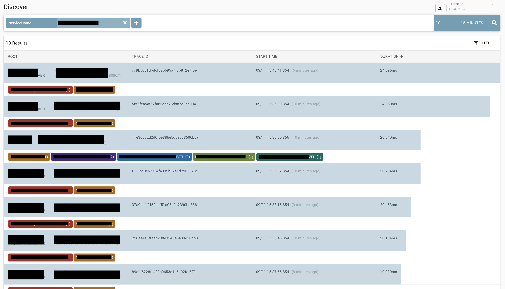
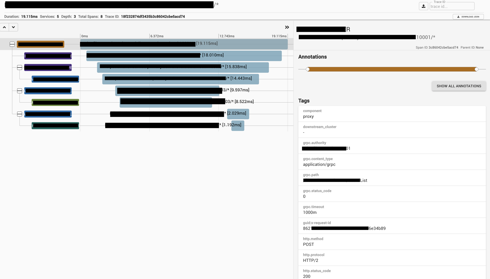
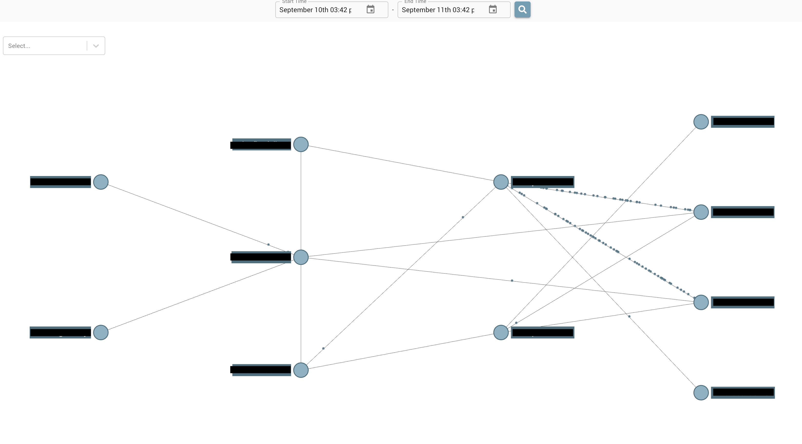

## ここに記載されていること一覧

- 分散トレーシングとは
- Zipkinとは
- gRPCにzipkinを導入
- ZipkinのUI

### 分散トレーシングとは

### Zipkinとは

### アーキテクチャ構成

参考文献: [Architecture - OpenZipkin](https://zipkin.io/pages/architecture.html)

ついでに、Jaegerのアーキテクチャ構成も載せておきます。

参考文献: [Architecture - OpenZipkin](https://www.jaegertracing.io/docs/1.18/architecture/)

### gRPCにzipkinを導入

### ZipkinのUI

絞り込み検索をすることにより、見たい処理を検索することが可能です。

各プロセスの処理時間、レイテンシが確認できます。

各サービスが、どれくらい通信しているかが可視化できるのはいいですね。

### 参考文献

[OpenZipkin](https://zipkin.io/)

[zipkin - GoDoc](https://godoc.org/github.com/openzipkin/zipkin-go)

[GitHub - openzipkin/zipkin-go](https://github.com/openzipkin/zipkin-go)

[分散トレーシングシステムのZipkinを使ってみた話](https://qiita.com/miya10kei/items/2532b80fcd8d19eb2e75)
