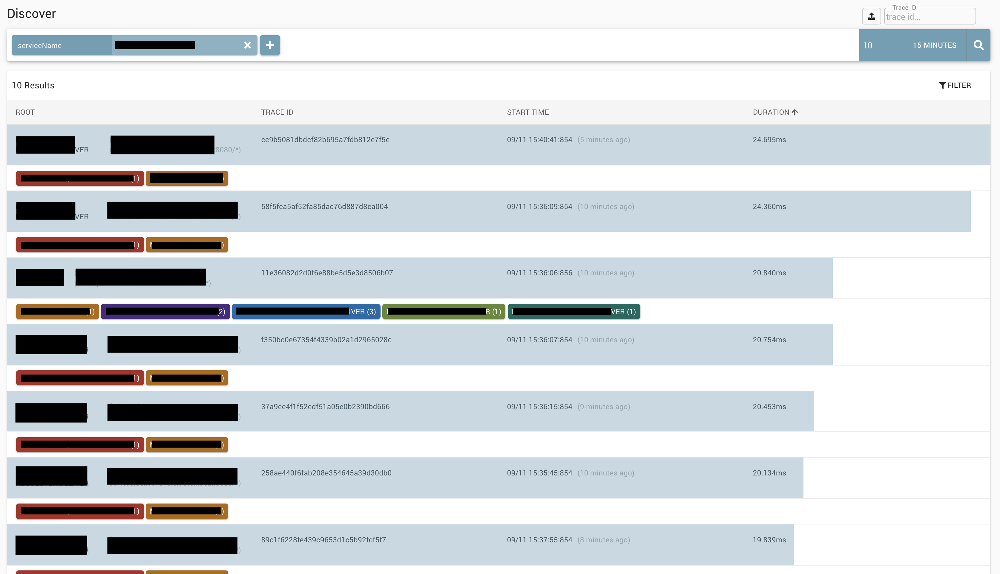
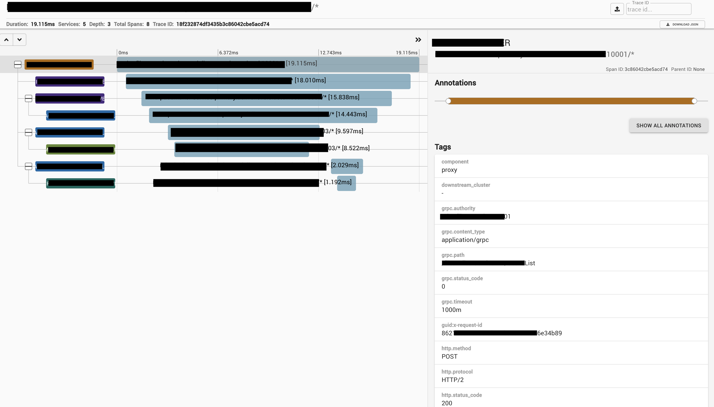
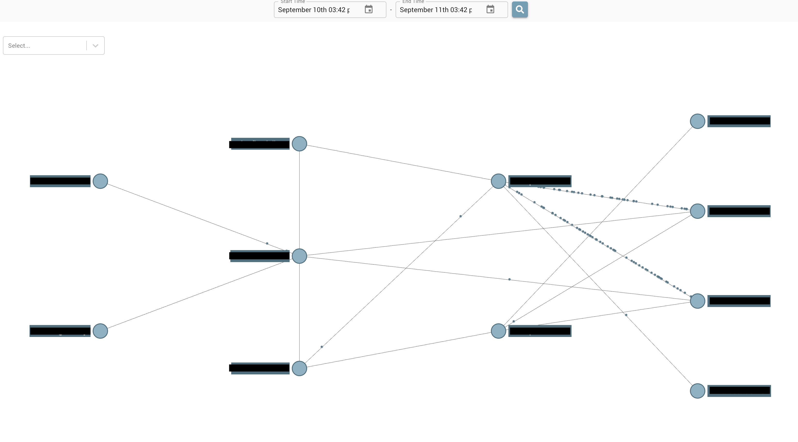

## ここに記載されていること一覧

- 分散トレーシングとは
- Zipkinとは
- gRPCにzipkinを導入
- ZipkinのUI

### 分散トレーシングとは

マイクロサービスで、従来のアプリケーションアーキテクチャと異なり、1つのアプリケーションをビジネス機能に沿って、複数の小さなサービスに分けて構成している。

小さくサービスを分け、疎に結合しているからこそ、問題点への改善、新機能の追加を迅速に行うことが可能です。

しかしながら、小さくサービスを分けて運用することにより、アプリケーションのリクエストはエンドツーエンドで把握しないとならない問題点が浮き彫りになります。

分散トレーシングは、分散されたシステム内のリクエストを追跡し、内容を可視化することにより問題解決を簡単にかつ迅速にするための技術です。

サービス間の依存関係やサービス単位のレイテンシを可視化することによって、僕らエンジニアの問題解決の手助けをするシステムとなっています。

### Zipkinとは

[Zipkin](https://github.com/openzipkin/zipkin)は、Googleの[Dapper](https://static.googleusercontent.com/media/research.google.com/ja//pubs/archive/36356.pdf)を参考に、Twitter社によって開発されたOSSです。

レイテンシ問題のトラブルシューティングに必要なデータを収集するAPIと、そのデータを可視化や、システムの依存関係を参照するためのUIを提供します。

### アーキテクチャ構成

Zipkinのアーキテクチャ構成ですが、公式サイトから引用します。


参考文献: [Architecture - OpenZipkin](https://zipkin.io/pages/architecture.html)

Zipkinでは大きく5つのコンポーネントに分けられています。

Reporter, Collector, Storage, API, UI

ついでに、Jaegerのアーキテクチャ構成も載せておきます。

参考文献: [Architecture - OpenZipkin](https://www.jaegertracing.io/docs/1.18/architecture/)

### gRPCにZipkinを導入

今回はGoで実装されているAPIに対して、Zipkinを導入していきます。

[openzipkin / zipkin-go | GitHub](https://github.com/openzipkin/zipkin-go)を参考に導入すれば良さそうです。

gRPCだと、grpcのハンドラに対してトレースするように追記すれば終了です。

参考文献: [gRPCでのZipkin導入](https://github.com/openzipkin/zipkin-go#grpc)

```go
import (
	"google.golang.org/grpc"
	zipkingrpc "github.com/openzipkin/zipkin-go/middleware/grpc"
)

server = grpc.NewServer(grpc.StatsHandler(zipkingrpc.NewServerHandler(tracer)))
```

### ZipkinのUI

**画像の一部をモザイク処理しようとしたのですが、最近の技術で解析されるレベルになってきたので、黒塗りしてます。** 参考文献: [写真のモザイクを除去して“ほぼ”復元させるAIが登場](https://ampmedia.jp/2020/06/29/ledge-ai-93/)

絞り込み検索をすることにより、見たい処理を検索することが可能です。



各プロセスの処理時間、レイテンシが確認できます。



各サービスが、どれくらい通信しているかが可視化できるのはいいですね。



### 参考文献

[OpenZipkin](https://zipkin.io/)

[zipkin - GoDoc](https://godoc.org/github.com/openzipkin/zipkin-go)

[GitHub - openzipkin/zipkin-go](https://github.com/openzipkin/zipkin-go)

[分散トレーシングシステムのZipkinを使ってみた話](https://qiita.com/miya10kei/items/2532b80fcd8d19eb2e75)

[LINEのマイクロサービス環境における分散トレーシング](https://engineering.linecorp.com/ja/blog/distributed-tracing-line-microservice-environment/)

[クックパッドと分散トレーシング](https://techlife.cookpad.com/entry/2017/09/06/115710)

### 合わせて読みたい

[楽天 インターンに参加しました](https://yoshikawa.dev/rakuten-intern)

[サイバーエージェント インターンに参加しました](https://yoshikawa.dev/cyberagent-intern)

[マネーフォワードのインターンでコンテナイメージ脆弱性検査](https://yoshikawa.dev/moneyforward-intern)