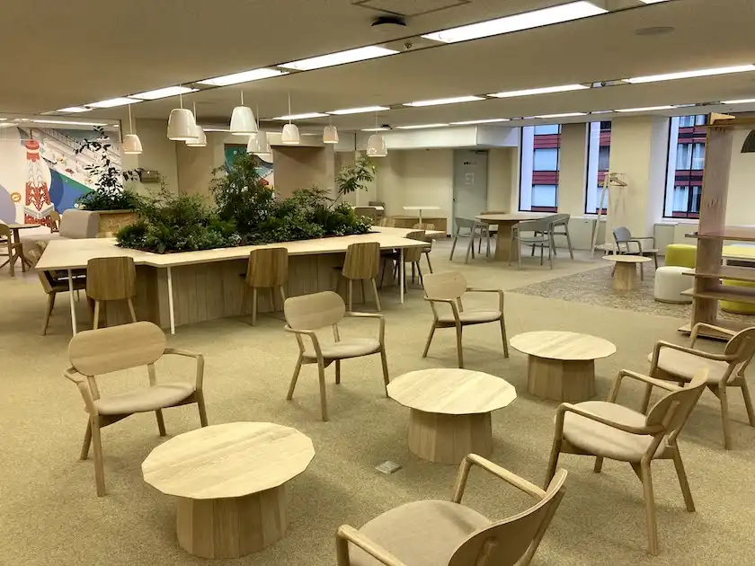
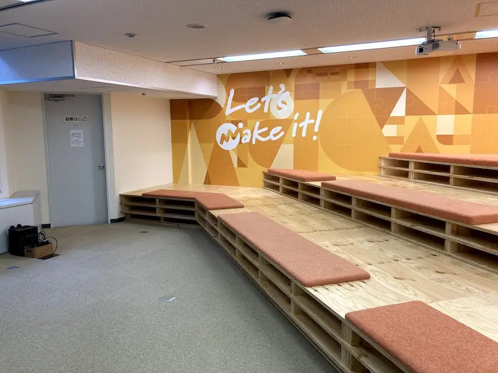
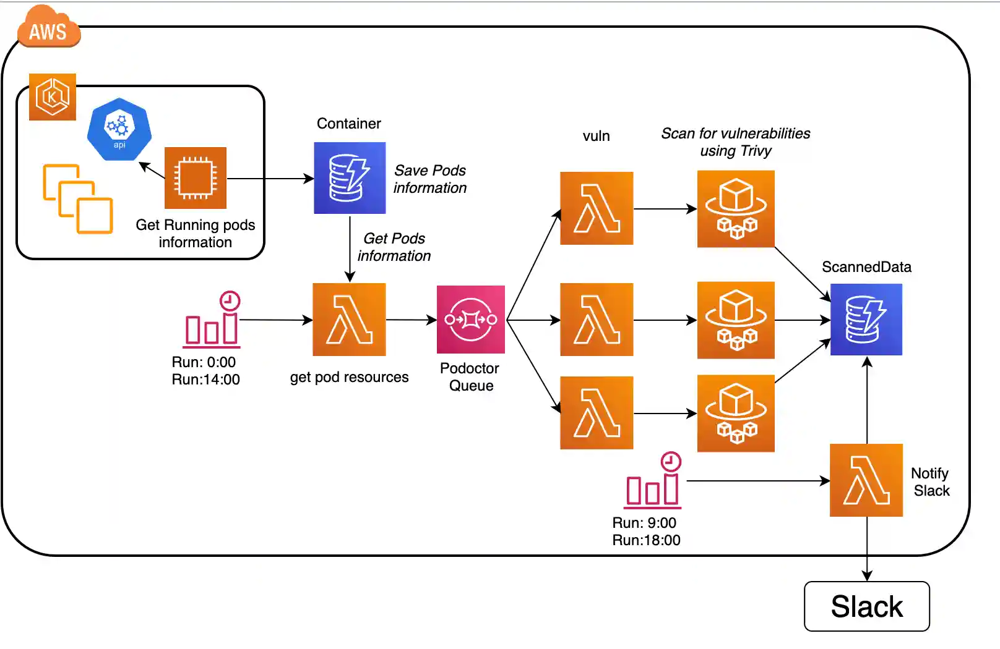
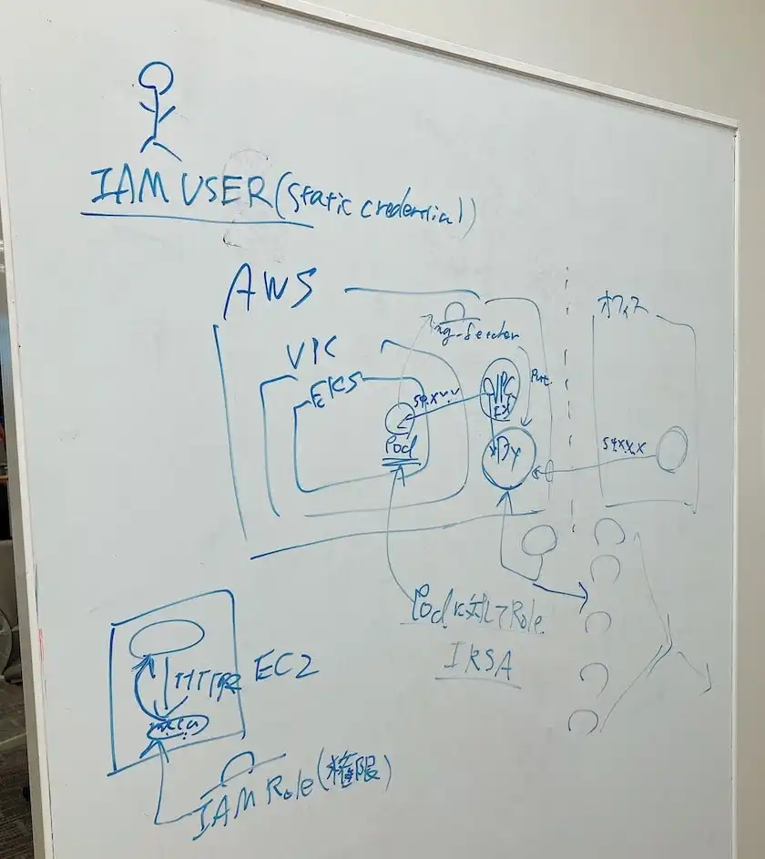
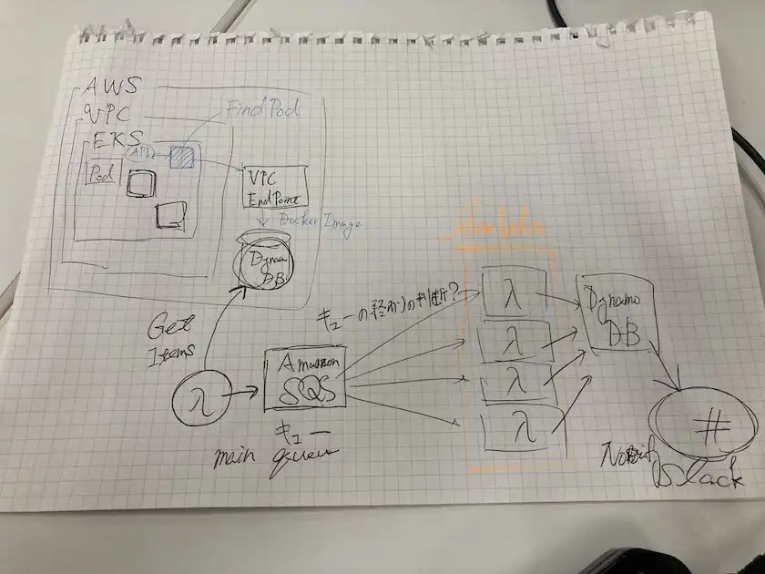

どうも、よしかわです。
9月中旬に行われたマネーフォワードのインターンについて参加しましたので、忘れないうちにブログ記事にしていきます。

インフラチームで2週間ほど開発して、得た知見や後輩へ思いが伝われば嬉しいです。

### マネーフォワードについて

公式サイト([https://corp.moneyforward.com/](https://corp.moneyforward.com/))を見てもらうのが一番手っ取り早いです。

- [「お金を前へ。人生をもっと前へ。」の理念](https://corp.moneyforward.com/aboutus/mission/)のもと、テクノロジーでお金の問題を解決しているFinTech企業
- 「[マネーフォワード ME](https://moneyforward.com/)」という家計簿アプリ、バックオフィスの業務効率向上を行う「[マネーフォワードクラウド](https://biz.moneyforward.com/)」など様々なプロダクトを手がけている

#### オフィス風景

三田オフィスの風景ですが、参考になれば光栄です。

気軽にくつろげる休憩場所があります。

ミートアップルームです(サウナ行きたい)

### インターンについて

期間は、9月15日から30日までの2週間です。

職種は、インフラエンジニアとして採用されました。

就業型インターンなので、人事やエンジニアと面談をし、配属部署を決定しました。

#### 配属部署

前述のように、サービス基盤本部のインフラ部に配属でした。
チームが2つあって、オンプレミス環境の保守・改善を手がけるチームとサーバのクラウド移行や改善を行うチームがあります。

今回は、僕がやりたいことを選んだので、クラウド移行や改善を行うチームのほうへ。

### タスクについて

今回は、定期的にコンテナイメージ脆弱性検査を行う機構づくりをします。

マネーフォワードではアプリケーションをコンテナ化し、Amazon EKS(Elastic Kubernetes Service)を用いて動作しています。
CodeBuild, CodeDeployを使ったCI(Continuous Integration)/CD(Continuous Delivery)では、コードをアップロードした時に脆弱性スキャンが始まります。

しかしながら、コードを頻繁にアップロードしないサービスはどうでしょうか。
脆弱性スキャンが走らず、脆弱性のあるコンテナが1週間、1ヶ月…とサービス運用に使われるケースもあるでしょう。

そのため、**定期的に**コンテナイメージ脆弱性検査を行う機構づくりをします

### アーキテクチャと実装

使用した技術は以下です。

- AWS Fargate
- AWS Lambda
- Amazon SQS
- Amazon DynamoDB
- Amazon EventBridge

EKS内のKubernetes APIにポッド情報を取得してきて、DynamoDBにポッドの情報を保存します。

次に、定期的にポッドの情報を取得し、キューに情報を送ります。

キューは、Lambdaと紐づけていて、並列に脆弱性スキャンをかけるようにしました。

FargateでTrivyコンテナを起動させ、脆弱性スキャンを行います。

脆弱性一覧は、DynamoDBに格納され、定期的にSlackに報告されます。(今回は、クリティカルとハイの脆弱性のみ報告)

#### タスク中に躓いたこと

タスクを遂行するために経験した失敗をまとめていきます。

AWSの知識がなかったので、最初のころは苦労をしました。
まず、IAM(Identity and Access Management)が独特だったこと。

一番躓いたことですが、脆弱性スキャンのTrivyでした。

Trivyですが、最初はLambda上で動かそうとしていました。

しかしながら、Lambdaだと実行ユーザがROOTユーザではないため、Trivyコマンドを実行出来ませんでした。

そこで、仕方なくFargate上にTrivyを動作させるアーキテクチャ構成になっています。

メンターと構成を考えました。

また、メンター以外にも、インフラチームに支えていただきました。本当に感謝しています。

これは、僕がインターン中にメモ書きしていたが、最終構成と違う仕様ですね…

### ランチについて

ほぼ毎日、社員さんとご飯行ってました。

本当に美味しかったです。

msb Tamachi 田町ステーションタワーNのレストランはキレイでした。

### 参考文献

[Trivy + AWSによるコンテナイメージ脆弱性検査パイプラインの構築 | クックパッド開発者ブログ](https://techlife.cookpad.com/entry/catbox)

[aquasecurity/trivy | GitHub.com](https://github.com/aquasecurity/trivy)

### 合わせて読みたい

[楽天 インターンに参加しました](https://yoshikawa.dev/rakuten-intern)

[サイバーエージェント インターンに参加しました](https://yoshikawa.dev/cyberagent-intern)