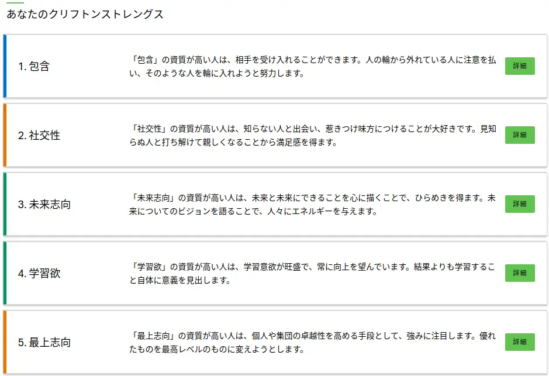

どうも，よしかわです．
10 月上旬に行われた Sansan のインターンについて参加しましたので，忘れないうちにブログ記事にしていきます．

基盤チームで開発をした経験を綴っていきます．

### Sansan について

公式サイト([https://jp.corp-sansan.com/](https://jp.corp-sansan.com/))を見てもらうのが一番手っ取り早いです．

- [出会いからイノベーションを生み出す](https://jp.corp-sansan.com/company/principles/)のもと、出会いの力でビジネスの課題にイノベーションを起こす
- 「[Sansan](https://jp.sansan.com/)」という法人向けクラウド名刺管理サービス、個人向け名刺アプリである「[Eight](https://8card.net/)」など様々なプロダクトを手がけている

### 強みについて

Sansan ではストレングスファインダーとエニアグラムで自分自身の強みや弱みは何かを見つけます．

それらを元に「強マッチ」というプレゼンする場があります．

自分のことを知る・知ってもらう機会を頂ける貴重な体験となりました．

### ミッション

個人向け名刺管理アプリである[Eight](https://8card.net/)で登録される名刺の姓名分割の精度向上です．

取り組んだミッションの詳細は書きませんが，最終日前日に Sansan エンジニアの皆様の協力でリリースすることが出来ました．

- API の作成
- Model の修正
- テストコードの追記

### 感想

Sansan は，「強みを活かし，成果を出す」が [Value](https://jp.corp-sansan.com/company/principles) にあります．

最終成果発表を終えた後，CTO からありがたいことに「もっと出来たんじゃないか？」という質問をいただきました．

確かに，チームと協力して自分たちの開発をさらに向上出来たと振り返ってみて思いました．

Sansan はプロフェッショナルを求めているということを何回も聞きました．

僕は未熟ながらも，無意識だったものを意識してプロフェッショナルにいち早くなりたいです．

インターンを経験して，より一層 Sansan の皆様と開発をしたいと思いました．

みんなも Sansan のインターンに是非応募して，参加してほしいです．

最後に，メンターの倉田さん，そしてチームの皆様，人事，Eight の皆様，DSOC や色んな人々に支えられてインターンを体験させていただきました．本当にありがとうございました．

「自分の強みを活かし，他者の強みを活かし，開発を加速させるエンジニア」になろうと思います．

### その他

コードレビューが早いし，的確でした．

チームで開発していたので，プルリクエストをするときには，「自分が何をしたいか」を明確に書いていたのを，今でも覚えています．

また，エンジニアの作業スピードが尋常ではなく，僕もこんなエンジニアになりたいと強く思いました．

### 合わせて読みたい

[楽天 インターンに参加しました](https://yoshikawa.dev/rakuten-intern)

[サイバーエージェント インターンに参加しました](https://yoshikawa.dev/cyberagent-intern)

[マネーフォワードのインターンでコンテナイメージ脆弱性検査](https://yoshikawa.dev/moneyforward-intern)
